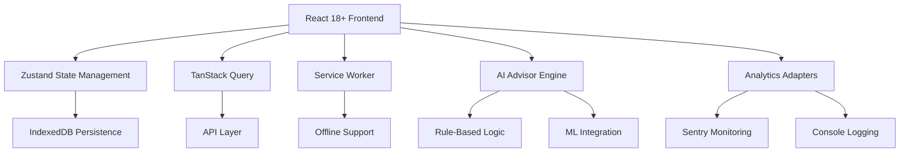

# TeenOS Growth Operating System

[](https://reactjs.org/)
[](https://www.typescriptlang.org/)
[](https://vitejs.dev/)
[](LICENSE)

A production-ready, enterprise-grade Growth Operating System designed for teenagers (15-17) to develop goals, skills, habits, and financial literacy through an engaging gamified experience with AI-powered guidance.

## 🏗️ Architecture Overview

### Domain-Driven Design
The application follows a sophisticated **Domain-Driven Design (DDD)** architecture with clear separation of concerns and bounded contexts:

```
src/
├── domains/                    # Bounded contexts (9 domains)
│   ├── auth/                  # Authentication & Authorization
│   ├── user/                  # User Profiles & Preferences  
│   ├── goals/                 # Goal Management & Tracking
│   ├── skills/                # Skill Development & Progression
│   ├── habits/                # Habit Formation & Consistency
│   ├── gamification/          # Points, Badges & Leaderboards
│   ├── ai-advisor/            # AI-Powered Recommendations
│   ├── analytics/             # Telemetry & Observability
│   └── finance/               # Financial Management
├── infrastructure/            # Cross-cutting concerns
├── shared/                    # Reusable components & utilities
├── routes/                    # Application routing
└── assets/                    # Static resources
```

### Technical Architecture



## 🚀 Key Features

### 🔐 Enterprise Authentication
- **JWT-based Security**: In-memory access tokens with HTTP-only cookie refresh
- **Session Management**: Automatic token rotation and expiration handling
- **Protected Routes**: Role-based access control with authentication guards
- **Secure Storage**: Encrypted credential management

### 🎯 Goal Management System
- **Smart Goal Tracking**: Progress visualization with milestone celebrations
- **Category Organization**: Custom goal categories with filtering capabilities
- **Achievement Engine**: Automated celebration mechanics for completed goals
- **Progress Analytics**: Real-time tracking with performance insights

### 🧠 Skill Development Platform
- **Competency Framework**: Level-based skill progression system
- **Practice Logging**: Detailed activity tracking and time logging
- **Achievement Badges**: Gamified recognition for skill milestones
- **Skill Analytics**: Performance metrics and improvement recommendations

### 📊 Habit Formation Engine
- **Consistency Tracking**: Streak management with visual progress indicators
- **Smart Scheduling**: Automated reminders and habit scheduling
- **Behavior Analytics**: Pattern recognition and habit insights
- **Personalization**: Adaptive difficulty and custom habit categories

### 🎮 Advanced Gamification
- **Points Economy**: Sophisticated reward system with multipliers
- **Badge System**: Tiered achievements with unlockable rewards
- **Social Leaderboards**: Real-time ranking with peer comparison
- **Level Progression**: Experience-based advancement with milestones

### 🤖 AI-Powered Advisor
- **Rule-Based Engine**: Business logic-driven personalized recommendations
- **Configurable Advisors**: Swappable advisor implementations
- **Context-Aware**: Personalized suggestions based on user data
- **ML Ready**: Extensible architecture for future machine learning integration

### 📈 Analytics & Observability
- **Adapter Pattern**: Pluggable analytics providers (Sentry, Console, etc.)
- **Error Tracking**: Comprehensive error monitoring and reporting
- **Performance Metrics**: Real-time performance analytics
- **User Behavior**: Insightful telemetry for product optimization

### 💰 Financial Intelligence
- **Transaction Management**: Comprehensive income/expense tracking
- **Budget System**: Category-based budgeting with progress visualization
- **Savings Goals**: Goal-oriented financial planning with deadline tracking
- **Financial Analytics**: Personal finance insights and savings rate calculations

### 🌐 PWA & Offline-First
- **Progressive Web App**: Installable native-like experience
- **Offline Capability**: Full functionality without internet connection
- **Background Sync**: Automatic data synchronization when online
- **Performance Optimized**: Lightning-fast load times and smooth interactions

## 🛠️ Tech Stack

### Core Technologies
| Layer | Technology | Version | Purpose |
|-------|------------|---------|---------|
| **Framework** | React | 18+ | UI Library |
| **Language** | TypeScript | 5+ | Type Safety |
| **Build Tool** | Vite | 4+ | Fast Development |
| **State Management** | Zustand | 4.4+ | Global State |
| **Data Fetching** | TanStack Query | 5.0+ | Server State |
| **Styling** | SCSS | 1.65+ | Styling Solution |
| **Database** | Dexie.js | 3.2+ | IndexedDB Wrapper |
| **Testing** | Vitest | 0.34+ | Unit Testing |
| **Charts** | D3.js | 7.8+ | Data Visualization |

### Security & Infrastructure
- **JWT Authentication**: Secure token-based authentication
- **HTTP-Only Cookies**: Protected credential storage
- **Service Worker**: Offline-first capabilities with Workbox
- **Content Security Policy**: Enhanced security headers
- **Error Boundaries**: Graceful error handling

### Development Experience
- **ESLint**: Strict code quality enforcement
- **Prettier**: Automated code formatting
- **Husky**: Git hooks for code quality
- **CommitLint**: Conventional commit messages
- **Storybook**: Component documentation

## 📦 Installation & Setup

### Prerequisites
- Node.js 18+ 
- npm 8+ or yarn 1.22+

### Quick Start
```bash
# Clone the repository
git clone https://github.com/your-org/teenos.git
cd teenos

# Install dependencies
npm install

# Start development server
npm run dev

# Build for production
npm run build

# Run tests
npm run test

# Lint code
npm run lint
```

### Environment Configuration
Create `.env` file:
```env
# API Configuration
VITE_API_URL=http://localhost:3001/api
VITE_APP_NAME=TeenOS

# Analytics
VITE_SENTRY_DSN=your-sentry-dsn
VITE_ANALYTICS_ENABLED=true

# Feature Flags
VITE_PWA_ENABLED=true
VITE_OFFLINE_MODE=true
```

## 🧪 Testing Strategy

### Test Coverage
- **Unit Tests**: Component and service level testing with Vitest
- **Integration Tests**: Cross-domain functionality verification
- **E2E Tests**: User journey validation with Playwright
- **Performance Tests**: Load and stress testing scenarios

### Testing Philosophy
```typescript
// Example unit test structure
describe('FinanceService', () => {
  beforeEach(() => {
    localStorage.clear();
  });

  it('should calculate financial summary correctly', () => {
    // Test implementation
  });
});
```

## 📊 Performance & Optimization

### Key Metrics
- **First Load**: < 2 seconds
- **Time to Interactive**: < 1.5 seconds
- **Bundle Size**: < 500KB gzipped
- **Lighthouse Score**: > 95

### Optimization Techniques
- **Code Splitting**: Dynamic imports for lazy loading
- **Bundle Analysis**: Webpack Bundle Analyzer integration
- **Caching Strategy**: Service worker with cache-first approach
- **Image Optimization**: Modern image formats and lazy loading

## 🚀 Deployment

### Production Build
```bash
# Production build
npm run build

# Preview production build
npm run preview

# Analyze bundle
npm run analyze
```

### Deployment Options
- **Vercel**: Zero-configuration deployment
- **Netlify**: Static site hosting with forms
- **AWS S3/CloudFront**: Enterprise-grade hosting
- **Docker**: Containerized deployment

## 📚 Documentation

### Domain Documentation
Each domain includes comprehensive documentation:
- Implementation details and architecture
- API references and usage examples
- Component specifications
- Future enhancement opportunities

### Developer Guides
- **Architecture Decision Records**: Key technical decisions
- **Coding Standards**: TypeScript and React best practices
- **Contribution Guidelines**: Development workflow
- **API Documentation**: OpenAPI specification

## 🤝 Contributing

### Development Workflow
1. **Fork** the repository
2. **Create** a feature branch (`git checkout -b feature/amazing-feature`)
3. **Commit** changes following conventional commits
4. **Push** to the branch (`git push origin feature/amazing-feature`)
5. **Open** a Pull Request

### Code Standards
- **TypeScript Strict Mode**: No implicit any types
- **ESLint Rules**: Strict code quality enforcement
- **Commit Messages**: Conventional commit format
- **Testing**: 100% test coverage for new features

### Branch Strategy
- `main`: Production-ready code
- `develop`: Development branch
- `feature/*`: Feature development
- `hotfix/*`: Critical bug fixes
- `release/*`: Release preparation

## 🔒 Security

### Security Measures
- **JWT Token Management**: Secure token rotation and validation
- **Input Sanitization**: DOMPurify for XSS protection
- **Rate Limiting**: API request throttling
- **Security Headers**: CSP, HSTS, and XSS protection
- **Dependency Scanning**: Automated vulnerability detection

### Security Audits
- Regular security scanning with automated tools
- Manual penetration testing
- Third-party security review
- Compliance with OWASP guidelines

## 📈 Monitoring & Analytics

### Observability Stack
- **Error Tracking**: Sentry integration for real-time error monitoring
- **Performance Monitoring**: Core Web Vitals tracking
- **User Analytics**: Custom event tracking
- **Infrastructure Monitoring**: Service health checks

### Key Metrics Tracked
- User engagement and retention
- Feature adoption rates
- Performance benchmarks
- Error rates and resolution times

## 🎯 Future Roadmap

### Short-term (Next 3 months)
- [ ] Mobile app development (React Native)
- [ ] Social features and peer collaboration
- [ ] Advanced analytics dashboard
- [ ] API integration with external services

### Medium-term (3-6 months)
- [ ] Machine learning integration for AI advisor
- [ ] Multi-language support
- [ ] Advanced financial planning tools
- [ ] Parent/guardian portal

### Long-term (6+ months)
- [ ] Blockchain integration for achievements
- [ ] Marketplace for skill exchange
- [ ] Advanced personalization engine
- [ ] Enterprise version for schools

## 📄 License

This project is licensed under the MIT License - see the [LICENSE](LICENSE) file for details.

## 🙏 Acknowledgments

- **React Team** for the amazing framework
- **Vite Team** for the blazing fast build tool
- **Open Source Community** for the incredible ecosystem
- **Teen Development Experts** for domain insights

## 📞 Support

For support, feature requests, or questions:
- **Issues**: [GitHub Issues](https://github.com/your-org/teenos/issues)
- **Discussions**: [GitHub Discussions](https://github.com/your-org/teenos/discussions)
- **Documentation**: [Wiki](https://github.com/your-org/teenos/wiki)
- **Email**: support@teenos.app

---

<div align="center">
  <p>Built with ❤️ for the next generation of leaders</p>
  <p>Made with modern web technologies and best practices</p>
</div>