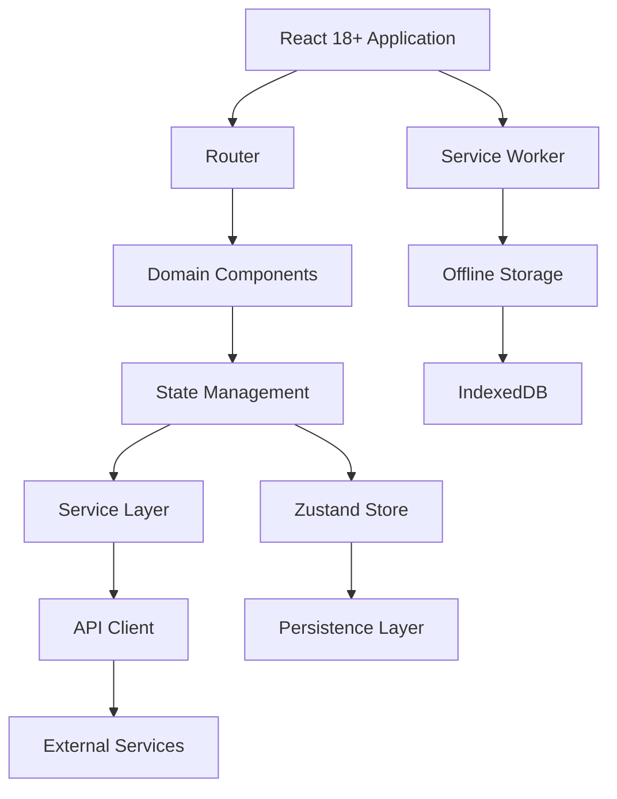
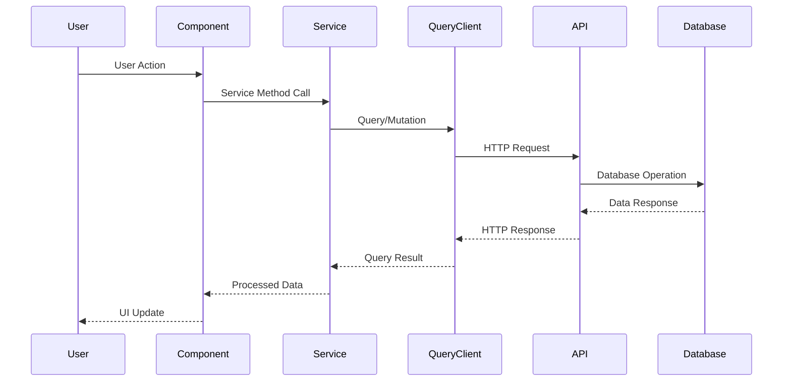
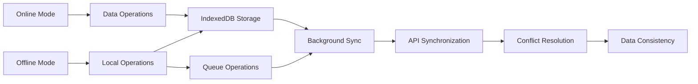
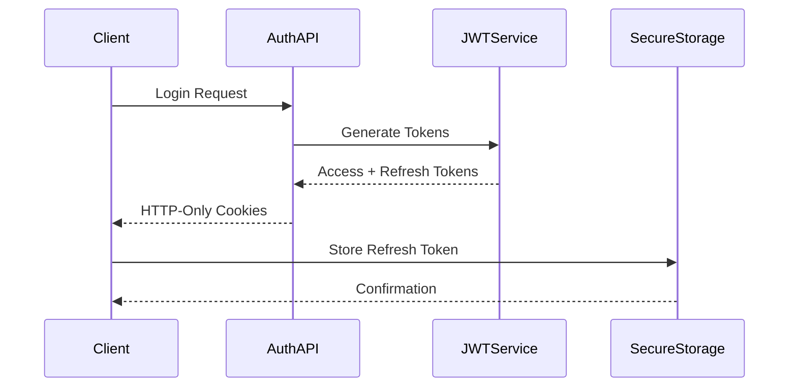
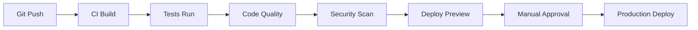

# TeenOS Architecture Documentation

## Table of Contents
1. [System Overview](#system-overview)
2. [Domain-Driven Design](#domain-driven-design)
3. [Technical Architecture](#technical-architecture)
4. [Data Flow](#data-flow)
5. [Security Architecture](#security-architecture)
6. [Performance Optimization](#performance-optimization)
7. [Deployment Architecture](#deployment-architecture)

## System Overview

TeenOS is a sophisticated Growth Operating System built with modern web technologies following enterprise-grade architecture principles. The system is designed to be:

- **Modular**: Clear separation of concerns with domain-driven design
- **Scalable**: Horizontal scaling capabilities with micro-frontend patterns
- **Maintainable**: Clean code principles with comprehensive documentation
- **Secure**: Industry-standard security practices and protocols
- **Performant**: Optimized for speed and user experience

## Domain-Driven Design

### Bounded Contexts

The application is organized into 9 distinct bounded contexts:

#### 1. Authentication Domain (`auth`)
**Responsibility**: User authentication, authorization, and session management
**Key Components**:
- JWT token management
- Session lifecycle handling
- Security middleware
- Protected route guards

#### 2. User Domain (`user`)
**Responsibility**: User profile management and preferences
**Key Components**:
- Profile CRUD operations
- Avatar management
- User preferences
- Personal information handling

#### 3. Goals Domain (`goals`)
**Responsibility**: Goal setting, tracking, and achievement management
**Key Components**:
- Goal creation and categorization
- Progress tracking
- Milestone celebrations
- Achievement validation

#### 4. Skills Domain (`skills`)
**Responsibility**: Skill development and competency tracking
**Key Components**:
- Skill categorization
- Progression levels
- Practice logging
- Achievement badges

#### 5. Habits Domain (`habits`)
**Responsibility**: Habit formation and consistency tracking
**Key Components**:
- Habit scheduling
- Streak management
- Consistency analytics
- Reminder system

#### 6. Gamification Domain (`gamification`)
**Responsibility**: Points, badges, and leaderboard system
**Key Components**:
- Points economy
- Badge awarding system
- Leaderboard rankings
- Achievement unlocking

#### 7. AI Advisor Domain (`ai-advisor`)
**Responsibility**: Personalized recommendations and guidance
**Key Components**:
- Rule-based advisor engine
- ML advisor integration
- Recommendation algorithms
- Context-aware suggestions

#### 8. Analytics Domain (`analytics`)
**Responsibility**: Telemetry, monitoring, and observability
**Key Components**:
- Analytics adapter pattern
- Error tracking
- Performance monitoring
- User behavior analytics

#### 9. Finance Domain (`finance`)
**Responsibility**: Personal financial management and tracking
**Key Components**:
- Transaction management
- Budget system
- Savings goals
- Financial analytics

## Technical Architecture

### Frontend Architecture



### Component Hierarchy

```
App
├── AuthProvider
│   └── Protected Routes
├── Domain Providers
│   ├── GoalsProvider
│   ├── SkillsProvider
│   ├── HabitsProvider
│   └── FinanceProvider
├── Shared Components
│   ├── Layout Components
│   ├── UI Components
│   └── Form Components
└── Infrastructure
    ├── API Client
    ├── Storage Service
    └── Analytics Service
```

### State Management Strategy

#### Global State (Zustand)
- User authentication state
- Domain-specific data
- Application preferences
- UI state management

#### Server State (TanStack Query)
- API data caching
- Background synchronization
- Optimistic updates
- Error handling

#### Local State (React useState/useReducer)
- Component-specific state
- Form management
- UI interactions
- Temporary data

## Data Flow

### Request-Response Cycle



### Offline Data Synchronization



## Security Architecture

### Authentication Flow



### Security Layers

1. **Transport Security**
   - HTTPS enforcement
   - HSTS headers
   - Secure cookie flags

2. **Authentication Security**
   - JWT token validation
   - Token expiration handling
   - Refresh token rotation

3. **Authorization Security**
   - Role-based access control
   - Protected route guards
   - Permission validation

4. **Data Security**
   - Input sanitization
   - XSS protection
   - CSRF protection

5. **Client Security**
   - Content Security Policy
   - Secure storage practices
   - Session management

## Performance Optimization

### Bundle Optimization

```javascript
// Code splitting configuration
const domainChunks = {
  auth: () => import('./domains/auth'),
  goals: () => import('./domains/goals'),
  skills: () => import('./domains/skills'),
  habits: () => import('./domains/habits'),
  finance: () => import('./domains/finance')
};

// Route-based lazy loading
const LazyComponent = lazy(() => 
  import('./domains/specific/Component')
);
```

### Caching Strategy

#### Service Worker Caching
```javascript
// Cache strategies
const CACHE_STRATEGIES = {
  ASSETS: 'cache-first',      // Static assets
  API: 'stale-while-revalidate', // API responses
  DYNAMIC: 'network-first'    // User data
};
```

#### Client-Side Caching
```javascript
// Query client configuration
const queryClient = new QueryClient({
  defaultOptions: {
    queries: {
      cacheTime: 1000 * 60 * 10,    // 10 minutes
      staleTime: 1000 * 60 * 5,     // 5 minutes
      refetchOnWindowFocus: false
    }
  }
});
```

### Performance Metrics

#### Core Web Vitals Targets
- **LCP (Largest Contentful Paint)**: < 2.5s
- **FID (First Input Delay)**: < 100ms
- **CLS (Cumulative Layout Shift)**: < 0.1

#### Custom Performance Monitoring
```javascript
// Performance tracking
const performanceMetrics = {
  appLoad: measureTime('app-load'),
  routeChange: measureTime('route-change'),
  apiResponse: measureTime('api-response')
};
```

## Deployment Architecture

### CI/CD Pipeline



### Deployment Environments

#### Development
- Feature branch deployments
- Hot reloading enabled
- Debug tools active
- Mock data services

#### Staging
- Production-like environment
- Real API integration
- Performance testing
- User acceptance testing

#### Production
- Optimized builds
- Monitoring enabled
- Automated scaling
- Backup systems

### Infrastructure Components

#### Frontend Hosting
- **Vercel**: Primary hosting platform
- **Cloudflare**: CDN and edge caching
- **AWS S3**: Static asset storage

#### Monitoring Stack
- **Sentry**: Error tracking and performance
- **LogRocket**: Session replay and debugging
- **Google Analytics**: User behavior analytics
- **Custom Metrics**: Business KPI tracking

#### Backup and Recovery
- **Daily Backups**: User data snapshots
- **Disaster Recovery**: Multi-region deployment
- **Rollback Capability**: Quick version rollback
- **Data Migration**: Schema evolution support

## Scalability Considerations

### Horizontal Scaling
- Stateless frontend components
- CDN distribution
- Load balancing
- Micro-frontend architecture

### Vertical Scaling
- Code splitting optimization
- Bundle size reduction
- Caching strategies
- Database optimization

### Future Scalability
- API gateway pattern
- Microservices architecture
- Event-driven design
- Serverless functions

---

*This architecture documentation is maintained and updated with each major release to reflect current implementation details and future roadmap considerations.*